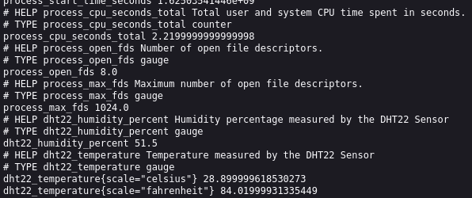
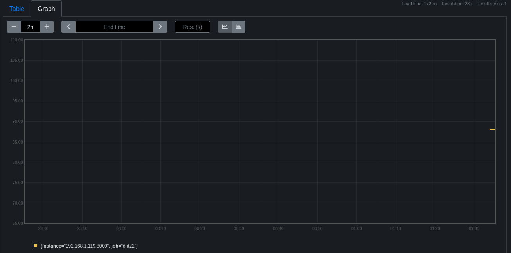

# Instrumenting an Application for Prometheus

Data is beautiful.

As a #CitizenScientist, I enjoy gathering data and trying to make sense of the world around me.
At work, we use [Prometheus](https://prometheus.io/) to gather metric data from our clusters, and at home, I use Prometheus to gather data from my hobbies.
This article will explore how to take an application, [a Python script that gathers temperature and humidity data from a sensor](LINK TO RASPBERRY PI DHT22 ARTICLE), and instrument it to provide data in a [data model that Prometheus can gather](https://prometheus.io/docs/concepts/data_model/).
We'll also create a [systemd service](https://www.freedesktop.org/software/systemd/man/systemd.service.html) to start and manage the application.

## What is Prometheus

Prometheus is an open source monitoring and alerting system that gathers metrics and provides a powerful query language for exploring the data.
I've written before about [setting up Prometheus locally at home](https://opensource.com/article/21/7/run-prometheus-home-container).
Prometheus is used frequently to gather data from container orchestration clusters such as [Kubernetes](https://kubernetes.io/) and [OpenShift](https://www.openshift.com/).
In my job as an SRE running OpenShift Dedicated clusters for Red Hat, Prometheus makes up the core of a robust monitoring and alerting system for all of our clusters, [operators](https://kubernetes.io/docs/concepts/extend-kubernetes/operator/) and applications.
Prometheus is used at huge scale by large enterprise organizations, but it is equally at home, well, at home, collecting data for hobbyist projects.

In the article mentioned above about working with a Raspberry Pi Zero and DHT22 to collect temperature and humidity data, I showed how to write a Python script to gather the data and print it to the screen.
That is good for checking the data manually for that exact moment, but it would be far more useful to gather and store the data so it could be examined historically.
This is where Prometheus shines as a time-series database with its own query language and graph capabilities.

## Instrument the app for Prometheus

Instrumenting the application for Prometheus requires, in a nutshell, taking the data from the sensor, labeling it, and serving it as text over HTTP so Prometheus can find and store the data.
Prometheus will check these text pages, or "targets" at a specified interval, looking for updates to the data, so the application will need to update the target metrics as new sensor data is received.

The format of the data exposed for Prometheus to gather consists of a key (metric name - that which is being measured) and value separated by a space (see below).

```text
dht22_temperature{scale="fahrenheit"} 84.01999931335449
```

Prometheus also supports optional labels to make it easier to filter and aggregate data.
For this application, labels are used to differentiate between celsius and fahrenheit scales for the `dht22_temperature` metric.
The `{scale="fahrenheit"}` is the label in the example above.
Check out the [Prometheus Data Model](https://prometheus.io/docs/concepts/data_model/) for more details.

The script can be modified manually to setup a webserver and print the sensor data, but Prometheus provides a [Prometheus Python Client](https://github.com/prometheus/client_python) that makes the process considerably easier.
This client can be installed using Pip, a Python package manager.
Pip can be installed using your distribution's package manager if you don't already have it, and then can be used to install `prometheus-client`.
I'm running Raspberry Pi OS on my sensor system, so I'll be using `apt-get` here, but substitute your package manager of choice.

```shell
# Install pip
sudo apt-get install pip3

# Install prometheus-client
sudo pip3 install prometheus-client
```

Now the sensor script from the previous article can be modified a bit for Prometheus.
We'll be tweaking it to store the sensor data as [Prometheus Gauges](https://prometheus.io/docs/concepts/metric_types/#gauge).
A gauge is "a metric that represents a single numerical value that can arbitrarily go up and down", as opposed to say, a counter, which only goes up.
Prometheus has a number of different metric types.
A gauge is perfect to represent temperature and humidity data.

Gauges are provided by the `prometheus_client.Gauge` module, and so needs to be imported before they can be used in the script:

```python
# Import Gauge and start_http_server from prometheus_client
from prometheus_client import Gauge, start_http_server
```

_Note: We'll be using `start_http_server` later to easily display the metrics via HTTP, so import that as well._

Next, the gauges can be created to store the humidity and temperature data. The `['scale']` bit adds the "scale" label for the temperature gauge, and the gauge is then initialized with both 'celsius' and 'fahrenheit' values for the label.

```python
# Create Prometheus gauges for humidity and temperature in
# Celsius and Fahrenheit
gh = Gauge('dht22_humidity_percent',
           'Humidity percentage measured by the DHT22 Sensor')
gt = Gauge('dht22_temperature',
           'Temperature measured by the DHT22 Sensor', ['scale'])

# Initialize the labels for the temperature scale
gt.labels('celsius')
gt.labels('fahrenheit')
```

After creating the gauges, they can be set with the sensor data when checking the sensor.

```python
    try:
        # Get the sensor data
        humidity, temperature = Adafruit_DHT.read_retry(SENSOR, SENSOR_PIN)
    except RuntimeError as e:
        log.error("RuntimeError: {}".format(e))

    if humidity is not None and temperature is not None:
        # Update the gauge with the sensor data
        gh.set(humidity)
        gt.labels('celsius').set(temperature)
        gt.labels('fahrenheit').set(celsius_to_fahrenheit(temperature))
```

This is done inside of a `while True:` loop (not shown, see the full script below) to continually update the gauges with data from the sensor.

Finally, Prometheus' `start_metrics_server` will serve the collected metrics via HTTP.
This is called before the while loop so the server starts first.

```python
    # Start the Prometheus metrics server to display the metrics data
    metrics_port = 8000
    start_http_server(metrics_port)
```

With all this together, the script should look something like this:

```python
#!/usr/bin/env python3

import logging
import time

import Adafruit_DHT

from prometheus_client import Gauge, start_http_server
from systemd.journal import JournalHandler

# Setup logging to the Systemd Journal
log = logging.getLogger('dht22_sensor')
log.addHandler(JournalHandler())
log.setLevel(logging.INFO)

# Initialize the DHT22 sensor
# Read data from GPIO4 pin on the Raspberry Pi
SENSOR = Adafruit_DHT.DHT22
SENSOR_PIN = 4

# The time in seconds between sensor reads
READ_INTERVAL = 30.0

# Create Prometheus gauges for humidity and temperature in
# Celsius and Fahrenheit
gh = Gauge('dht22_humidity_percent',
           'Humidity percentage measured by the DHT22 Sensor')
gt = Gauge('dht22_temperature',
           'Temperature measured by the DHT22 Sensor', ['scale'])

# Initialize the labels for the temperature scale
gt.labels('celsius')
gt.labels('fahrenheit')

def celsius_to_fahrenheit(degrees_celsius):
        return (degrees_celsius * 9/5) + 32

def read_sensor():
    try:
        humidity, temperature = Adafruit_DHT.read_retry(SENSOR, SENSOR_PIN)
    except RuntimeError as e:
        # GPIO access may require sudo permissions
        # Other RuntimeError exceptions may occur, but
        # are common.  Just try again.
        log.error("RuntimeError: {}".format(e))

    if humidity is not None and temperature is not None:
        gh.set(humidity)
        gt.labels('celsius').set(temperature)
        gt.labels('fahrenheit').set(celsius_to_fahrenheit(temperature))

        log.info("Temp:{0:0.1f}*C, Humidity: {1:0.1f}%".format(temperature, humidity))

    time.sleep(READ_INTERVAL)

if __name__ == "__main__":
    # Expose metrics
    metrics_port = 8000
    start_http_server(metrics_port)
    print("Serving sensor metrics on :{}".format(metrics_port))
    log.info("Serving sensor metrics on :{}".format(metrics_port))

    while True:
        read_sensor()
```

## Setup systemd unit and logging

The script is now ready to go, and would work with Prometheus as is, but I'm running this on headless (no monitor, keyboard, etc.) Raspberry Pi Zero Ws installed into project boxes with the DHT22 sensor and setup in different rooms of the house.
We'll add a Systemd service to automatically start the script at boot, and make sure it keeps running.
We'll also take advantage of the Systemd journal and send log data from the script (startup messages, error messages) to the journal.

The Systemd service will be a separate file used by Systemd, but the `python3-systemd` package is needed to send logs to the journal from the script.
It can be installed with `apt-get` (or your package manager):

```shell
# Install the python3-systemd package for Journal integration
sudo apt-get install python3-systemd
```

Within the service monitor script, the python logger can be configured to send logs to the journal by using the `systemd.journal.JournalHandler` module.
After importing the JournalHandler, it can be added as a handler for the logger:

```python
from systemd.journal import JournalHandler

# Setup logging to the Systemd Journal
log = logging.getLogger('dht22_sensor')
log.addHandler(JournalHandler())
log.setLevel(logging.INFO)
```

With this installed, logging to the journal can be accomplished with `log.info()`.
For example:

```python
# This will send the message to the Systemd Journal,
# and show up in `systemctl status` and with `journalctl`
log.info("Serving sensor metrics on :{}".format(metrics_port))
```

With the script updated to log to the Systemd journal, create a systemd service for the sensor-metrics.py script:

```txt
# /etc/systemd/system/sensor-metrics.service
[Unit]
Description=DHT22 Sensor Metrics Service
After=network.target
StartLimitIntervalSec=0

[Service]
Type=simple
Restart=always
ExecStart=python3 /opt/sensor-metrics/sensor-metrics.py

[Install]
WantedBy=multi-user.target
```

All this does is tell Systemd to look for a script in `/opt/sensor-metrics/sensor-metrics.py` start it and keep it running.
This will become the `sensor-metrics` service.

Link (or move, if you prefer) the sensor-metrics.py script to /opt/sensor-metrics/sensor-metrics.py:

```shell
# Create /opt/sensor-metrics and link the sensor-metrics.py script from the current directory into it
sudo mkdir /opt/sensor-metrics
sudo ln -s $(pwd)/sensor-metrics.py /opt/sensor-metrics/
```

Link the sensor-metrics.service file to /etc/systemd/system:

```shell
# Link the sensor-metrics.service file into the Systemd directory
sudo ln -s $(pwd)/sensor-metrics.service /etc/systemd/system/
```

Now you can enable the sensor-metrics service to start on boot, start it up, and check the status:

```shell
# Enable and start the sensor-metrics.service
sudo systemctl enable sensor-metrics.service
sudo systemctl start sensor-metrics.service
```

Now the service will be running and be set to start on boot.

To check if everything is running, check the service status with `systemctl`:

```shell
sudo systemctl status sensor-metrics.service
```

You should see something similar to this if everything is working:

```shell
● sensor-metrics.service - DHT22 Sensor Metrics Service
   Loaded: loaded (/home/chris/sensor-metrics.service; enabled; vendor preset: enabled)
   Active: active (running) since Wed 2021-06-30 03:33:02 BST; 8s ago
 Main PID: 4129 (python3)
    Tasks: 2 (limit: 877)
   CGroup: /system.slice/sensor-metrics.service
           └─4129 /usr/bin/python3 /opt/sensor-metrics/sensor-metrics.py

Jun 30 03:33:02 cumulo systemd[1]: Started DHT22 Sensor Metrics Service.
Jun 30 03:33:05 cumulo /opt/sensor-metrics/sensor-metrics.py[4129]: Serving sensor metrics on :8000
Jun 30 03:33:05 cumulo /opt/sensor-metrics/sensor-metrics.py[4129]: Temp:30.6*C, Humidity: 47.1%
```

Success!

## Check the metrics target

With the service running and the script modified to collect sensor data into gauges and display it for Prometheus, you can now view the data as Prometheus will.

In a browser, navigate to `http://<IP OF YOUR HOST>:8000`, substituting the IP Address of the machine running the sensor-metrics service.

You should see a page with several metrics about the Python client (bonus!), as well as the dht22_temperature and dht22_humidity metrics.
It should look something like this:

|  |
| :-: |
| *sniff* Data really IS beautiful! *sniff* |

Look at that!
Humidity _and_ temperature, and in two different scales!

This data will update each time the sensor data is checked by the service script.
Now, the last step: showing Prometheus where to look for all this data.

## Create a Prometheus Scrape Config

I'm going to assume you read the [article mentioned above about running Prometheus at home](https://opensource.com/article/21/7/run-prometheus-home-container), and have an instance already setup.
If you haven't, go ahead and do that now (and tell all your friends what a great experience it was).
That article shows how to setup Prometheus to read dynamic scrape configs from file, reloading automatically.
These scrape configs point Prometheus to the metric data targets it should ingest ("scrape").

Add a scrape config for the sensor-metrics data to the array (if any) in the scrape config JSON setup as part of that previous article.
Note the array show below has the single Prometheus sensor-metrics target.
Yours may already have other targets.
Just add to the list.

```json
// This scrape config target points to the IP Address of the Raspberry Pi and the Port used in the sensor-metrics.py script
// Substitute your own IP and the port you chose
[
  {"labels": {"job": "dht22"}, "targets": ["192.168.1.119:8000"]}
]
```

After restarting Prometheus, or waiting for it to find and load the new scrape config, Prometheus will begin looking for metrics data at the target you specified above.

## Bringing it all together

Finally, everything is running, and we can look at the data we're collecting!
Open the Prometheus web interface for your Prometheus server.
Mine is `http://localhost:9090/graph`, and yours may be the same if you followed the previous article.
Click on the "graph" tab, and search for `dht22_temperature{scale=~"fahrenheit"}` to see the temperature data being collected.

|  |
| :-: |
| Well.  That's disappointing. |

Ok, so, two things:

1. Time-series data is underwhelming at first, because you don't have much data yet. It gets better over time.
2. Ambient temperature data takes a somewhat longer period to display anything interesting, because it doesn't change much.

So, give it time.
Eventually it'll look much more interesting, and just get better with time:

|  |
| :-: |
| MUCH better! |

## Conclusion

Prometheus works so well for collecting metric data, storing it as time-series data, and providing a way to explore it.
I hope this article has inspired you to perform some #CitizenScience at home, create your own data and explore!
